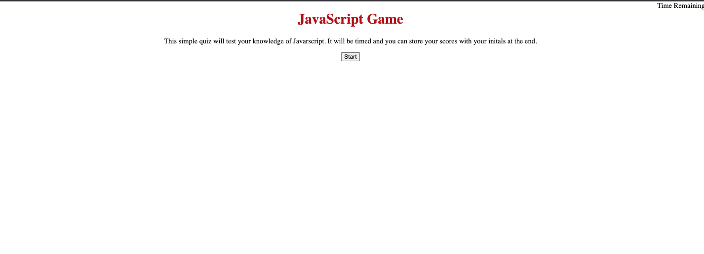
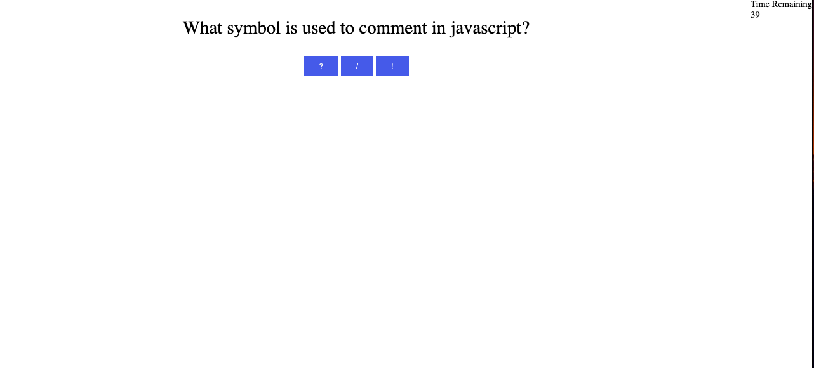
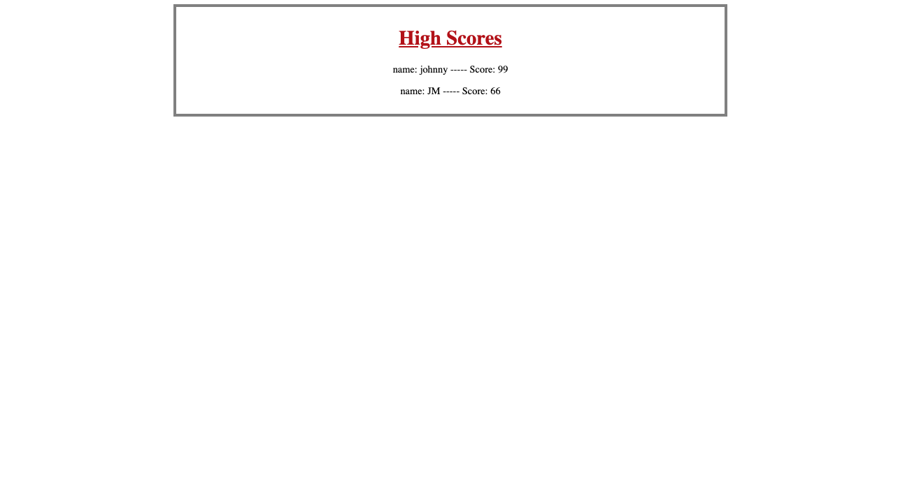

# JavaScript Quiz Week 4 Challenge

## Created a Javascript Quiz that:

* When Start button is clicked, timer starts and you are presented with a question
* After each question the next question is presented
* When timer hits 0 or all questions are answered, game is over
* You are presented with a screento enter your intials
* you are then taken to the High Score table

[Project Link](https://jmcgown14.github.io/quiz-game/)

